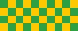

# SVG in the preview

A local drawing, with a sibling PNG referenced from inside it:

A remote badge, the shape most READMEs start with:

A PNG beside them, as the control:

A format nothing here draws, which must still name itself:

A path that really is missing, which must keep saying so:

